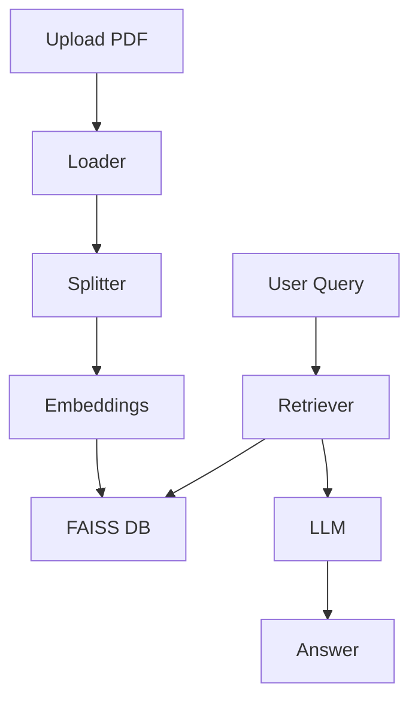
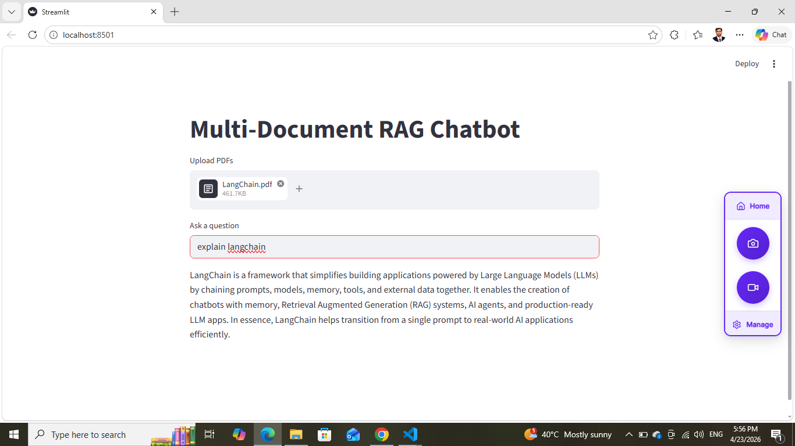

# 🤖 Multi-Document RAG Chatbot (Production-Ready)

A **scalable Retrieval-Augmented Generation (RAG) system** that enables users to upload multiple PDFs and interact with them using natural language queries.

Built with modern GenAI stack: **LangChain + FAISS + OpenAI + Streamlit + Docker**

---

## 🌟 Key Highlights

* 🔍 Semantic search over multiple documents
* 📄 Multi-PDF ingestion pipeline
* ⚡ Fast vector retrieval using FAISS
* 🧠 LLM-powered contextual answers
* 🐳 Fully containerized with Docker
* 💬 Interactive chat-based UI
* 📦 Production-ready modular architecture

---

## 🏗️ Architecture



---

## ⚙️ System Design

### 📌 Components

| Component                | Description                               |
| ------------------------ | ----------------------------------------- |
| **Loader**               | Extracts text from PDFs                   |
| **Splitter**             | Chunks large text into manageable pieces  |
| **Embeddings**           | Converts text → vector representation     |
| **Vector Store (FAISS)** | Stores & retrieves embeddings efficiently |
| **Retriever**            | Fetches relevant chunks                   |
| **LLM**                  | Generates final answer                    |
| **UI (Streamlit)**       | User interaction layer                    |

---

## 📂 Project Structure

```bash
genai-rag-chatbot/
│
├── app/
│   ├── chat_app.py
│   ├── rag_pipeline.py
│   ├── embeddings.py
│   ├── vector_store.py
│   ├── loader.py
│
├── data/
├── models/faiss_index/
├── utils/
│
├── requirements.txt
├── Dockerfile
├── .env
└── README.md
```

---

## 🚀 Quick Start

### 🔹 1. Clone Repo

```bash
git clone https://github.com/sudhirmahaseth/genai-rag-chatbot.git
cd genai-rag-chatbot
```

---

### 🔹 2. Setup Environment

```bash
uv venv --python=3.10
.venv\Scripts\activate
```

---

### 🔹 3. Install Dependencies

```bash
uv pip install -r requirements.txt
```

---

### 🔹 4. Add API Key

```env
OPENAI_API_KEY=your_api_key
```

---

### 🔹 5. Run App

```bash
uv run streamlit run app/chat_app.py
```

👉 Open: http://localhost:8501

---

## 🐳 Docker Deployment

### Build Image

```bash
docker build -t rag-chatbot .
```

### Run Container

```bash
docker run -p 8501:8501 -e OPENAI_API_KEY=your_key rag-chatbot
```

---

## 📸 Demo



```bash
/docs/demo.png
```

---

## 🧠 RAG Workflow (Deep Dive)

```text
1. PDF Upload
2. Text Extraction
3. Chunking (Recursive Splitter)
4. Embedding Generation
5. Vector Storage (FAISS)
6. Query → Vector Search
7. Context Retrieval
8. LLM Response Generation
```

---

## ⚡ Performance Considerations

* ⚙️ Chunk size optimized for retrieval accuracy
* 🔍 FAISS enables sub-second similarity search
* 📦 Docker ensures reproducible environments
* 🔁 Stateless design (can scale horizontally)

---

## 🧪 Example Queries

* "Explain LangChain architecture"
* "Summarize this document"
* "What are key takeaways?"
* "Compare concepts in the PDF"

---

## 📊 Future Enhancements

* ✅ Chat memory (conversation context)
* ✅ Source citations (page-level references)
* ✅ Persistent FAISS index
* ✅ Streaming responses (real-time output)
* ✅ LangGraph multi-agent workflows
* ✅ Hybrid search (PDF + Web)
* ✅ Authentication & multi-user support

---

## 📈 Resume Impact

> Designed and developed a production-ready Retrieval-Augmented Generation (RAG) system using LangChain, FAISS, and OpenAI, enabling intelligent question answering over multi-document inputs with scalable architecture and Docker deployment.

---

## 🧠 Interview Talking Points

* Difference between RAG vs Fine-tuning
* Why FAISS for vector search
* Chunking strategies & trade-offs
* Embedding models & similarity search
* Scaling RAG systems
* Handling hallucinations

---

## 🐳 Docker Hub

```bash
docker pull saket1992/rag-chatbot
```

---

## 🤝 Contributing

PRs are welcome! Open issues for improvements or bug fixes.

---

## 📜 License

MIT License

---

## 👨‍💻 Author

**Sudhir Kumar**
AI Engineer | 

---
